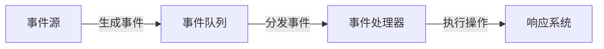

## 事件驱动开发详解及优质 GitHub 项目推荐

### 一、事件驱动开发核心概念

事件驱动开发（Event-Driven Development）是一种**以事件为中心**的编程范式，程序的执行流程由外部事件（如用户操作、系统通知、消息到达）触发，而非传统的顺序控制流。

#### 核心组件：


#### 关键特征：
1. **异步处理**：事件产生与处理解耦
2. **非阻塞 I/O**：高效利用系统资源
3. **松耦合架构**：组件间通过事件通信
4. **高并发支持**：单线程处理大量事件（如 Node.js）

---

### 二、事件驱动开发应用场景

| **场景**         | **典型案例**               | **优势**           |
| ---------------- | -------------------------- | ------------------ |
| **GUI 应用**     | 按钮点击、键盘输入处理     | 实时响应交互事件   |
| **网络服务器**   | Nginx/Node.js 高并发处理   | 支持数万并发连接   |
| **微服务架构**   | 服务间通过事件总线通信     | 解耦服务依赖关系   |
| **实时数据处理** | 股票行情分析、IoT 设备监控 | 低延迟处理流式数据 |
| **游戏开发**     | 玩家操作、物理引擎事件处理 | 高效处理高频事件   |

---

### 三、优质 GitHub 项目推荐

#### 1. 通用事件驱动框架
| **项目**     | 语言       | 特点                 | 链接                                                         |
| ------------ | ---------- | -------------------- | ------------------------------------------------------------ |
| **libevent** | C          | 轻量级跨平台事件库   | [github.com/libevent/libevent](https://github.com/libevent/libevent) |
| **libuv**    | C          | Node.js 底层引擎     | [github.com/libuv/libuv](https://github.com/libuv/libuv)     |
| **EventBus** | Java       | Android 事件总线     | [github.com/greenrobot/EventBus](https://github.com/greenrobot/EventBus) |
| **RxJS**     | JavaScript | 响应式编程事件流处理 | [github.com/ReactiveX/rxjs](https://github.com/ReactiveX/rxjs) |

#### 2. 网络与服务器
| **项目**    | 语言   | 特点               | 链接                                                         |
| ----------- | ------ | ------------------ | ------------------------------------------------------------ |
| **Netty**   | Java   | 高性能异步网络框架 | [github.com/netty/netty](https://github.com/netty/netty)     |
| **Tornado** | Python | 非阻塞 Web 服务器  | [github.com/tornadoweb/tornado](https://github.com/tornadoweb/tornado) |
| **Vert.x**  | Java   | 响应式应用框架     | [github.com/eclipse-vertx/vert.x](https://github.com/eclipse-vertx/vert.x) |

#### 3. 实时数据处理
| **项目**          | 语言       | 特点                | 链接                                                         |
| ----------------- | ---------- | ------------------- | ------------------------------------------------------------ |
| **Flink**         | Java/Scala | 流处理引擎          | [github.com/apache/flink](https://github.com/apache/flink)   |
| **Kafka Streams** | Java       | 基于 Kafka 的流处理 | [github.com/apache/kafka](https://github.com/apache/kafka)   |
| **Socket.IO**     | JavaScript | 实时双向通信库      | [github.com/socketio/socket.io](https://github.com/socketio/socket.io) |

#### 4. 游戏开发
| **项目**         | 语言 | 特点                         | 链接                                                         |
| ---------------- | ---- | ---------------------------- | ------------------------------------------------------------ |
| **Godot Engine** | C++  | 开源游戏引擎（事件驱动架构） | [github.com/godotengine/godot](https://github.com/godotengine/godot) |
| **SDL**          | C    | 多媒体事件处理库             | [github.com/libsdl-org/SDL](https://github.com/libsdl-org/SDL) |

---

### 四、学习资源与代码示例

#### 1. 事件驱动基础示例（Python）
```python
# 使用 asyncio 实现事件循环
import asyncio

async def handle_event(event):
    print(f"处理事件: {event}")
    await asyncio.sleep(1)

async def event_generator():
    for i in range(5):
        yield i

async def main():
    async for event in event_generator():
        await handle_event(event)

asyncio.run(main())
```

#### 2. 浏览器事件处理（JavaScript）
```javascript
// DOM 事件监听
document.getElementById("myBtn").addEventListener("click", function() {
    alert("按钮被点击!");
});

// 自定义事件
const event = new CustomEvent("build", { detail: { time: Date.now() } });
document.dispatchEvent(event);

document.addEventListener("build", e => {
    console.log(`自定义事件触发: ${e.detail.time}`);
});
```

#### 3. 深入学习的资源：
- **《Patterns of Enterprise Application Architecture》**：Martin Fowler 的事件模式章节
- **Node.js 事件循环详解**：[Node.js Event Loop Documentation](https://nodejs.org/en/docs/guides/event-loop-timers-and-nexttick/)
- **响应式编程教程**：[ReactiveX 官方文档](http://reactivex.io/)

---

### 五、事件驱动开发优势与挑战

#### ✅ 优势：


#### ⚠️ 挑战：
1. **调试困难**：异步调用栈复杂
2. **回调地狱**：嵌套回调降低可读性
3. **状态管理**：事件乱序导致状态不一致
4. **内存泄漏**：未正确移除事件监听器

#### 解决方案：
- 使用 `async/await` 替代回调
- 采用状态机管理复杂状态
- 使用内存分析工具（如 Chrome DevTools）
- 实施事件溯源（Event Sourcing）模式

---

通过研究这些开源项目和设计模式，您可以深入掌握事件驱动开发的精髓，构建高性能、松耦合的现代应用系统。